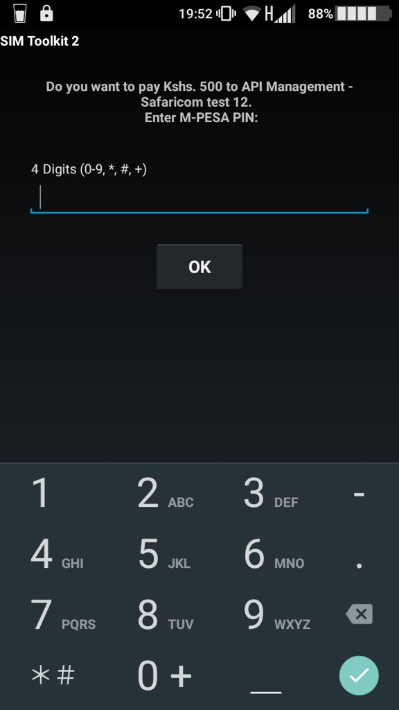

# MpesaStk
Lipa na M-Pesa Online Payment API is used to initiate a M-Pesa transaction on behalf of a customer using STK Push. This is the same technique mySafaricom App uses whenever the app is used to make payments.

## Installation

Add this line to your application's Gemfile:

```ruby
gem 'mpesa_stk'
```
and run the `bundle install` command

Or install it yourself as:
```ruby
gem install mpesa_stk
```

# Getting Started
This gem has a `[redis](https://redis.io/)` dependency, so make sure it running
```ruby
$ redis-server
```

you need to setup your environment variables, checkout `.sample.env` for the values you need.
or run
```ruby
$ cp .sample.env .env
```
open `.env` on youe editor and add the missing variable
```
key=""
secret=""
business_short_code=""
business_passkey=""
callback_url=""
```

* `key` and `secret` of the app created on your [developer account](https://developer.safaricom.co.ke/user/me/apps).
this can be found in [Test Credentials](https://developer.safaricom.co.ke/test_credentials)
* `business_short_code`  and `business_pass_key` from safaricom.
this is the url where response will be sent
* `callback_url` the url of your application. `make sure its a reachable/active url`

## Testing

```ruby
$ irb
```

```ruby
2.5.0 :001 > require 'mpesa_stk'
```

```ruby
2.5.0 :002 > MpesaStk::PushPayment.call("500", "<YOUR PHONE NUMBER: 254711222333>")
```

expected irb output after the command
```hash
=> {
    "MerchantRequestID"=>"7909-1302368-1", 
    "CheckoutRequestID"=>"ws_CO_DMZ_40472724_16062018092359957", 
    "ResponseCode"=>"0", 
    "ResponseDescription"=>"Success. Request accepted for processing", 
    "CustomerMessage"=>"Success. Request accepted for processing"
  }
```

the above response means the response has been successfully sent to Safaricom for processing and you should be able to see the checkout/express prompt on the sender number.

### Mpesa Checkout/Express
This is the expected output on the mobile phone


### Callback url

After the pin code is entered on the checkout/express prompt. you will receive a request on the provided  `callback_url` with the status of the action


## Development

After checking out the repo, run `bin/setup` to install dependencies. Then, run `rake test` to run the tests. You can also run `bin/console` for an interactive prompt that will allow you to experiment.

To install this gem onto your local machine, run `bundle exec rake install`. To release a new version, update the version number in `version.rb`, and then run `bundle exec rake release`, which will create a git tag for the version, push git commits and tags, and push the `.gem` file to [rubygems.org](https://rubygems.org).

## Contributing

Bug reports and pull requests are welcome on GitHub at https://github.com/mboya/mpesa_stk.

To Contribute to this gem,
* Comment on the issue you would like to work on solving.
* Mark the issue as in progress by adding an `in-progress` label.
* Fork the project to your github repository (This project only accepts PRs from forks)
* Submit the PR after the implementation all unfinished PRs for an issue should have a WIP indicated beside it
* Every PR should have a link to the issue being solved
* Checkout this [github best practices](https://github.com/skyscreamer/yoga/wiki/GitHub-Best-Practices) for more info.

## License

The gem is available as open source under the terms of the [MIT License](https://opensource.org/licenses/MIT).

## Code of Conduct

Everyone interacting in the MpesaStk project’s codebases, issue trackers, chat rooms and mailing lists is expected to follow the [code of conduct](https://github.com/mboya/mpesa_stk/blob/master/CODE_OF_CONDUCT.md).
